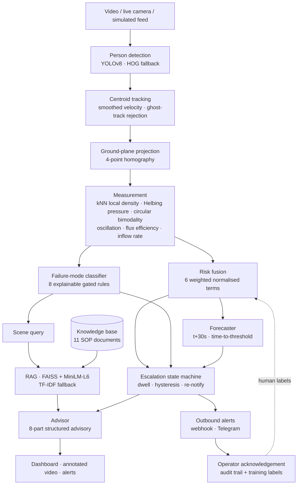

# 🛡️ CrowdGuard-RAG

> **Real-time crowd risk prediction and safety decision support**
> Computer vision · multi-modal risk physics · temporal forecasting · retrieval-augmented advice

[](https://www.python.org/)
[](https://docs.ultralytics.com/)
[](https://faiss.ai/)
[](https://streamlit.io/)

---

## 1. The problem

**Crowd disasters are not a detection problem. They are a decision-latency problem.**

Itaewon (2022), Astroworld (2021), Kanjuruhan Stadium (2022), Hillsborough (1989), Love Parade
(2010) — every one of those venues had CCTV, and people were watching it. What was missing was
never video. Between the moment a crowd becomes unsafe and the moment an operator acts
correctly, there are four gaps:

| Gap | What fails |
|---|---|
| **Observation** | 300 cameras, 6 operators, ~20-minute attention span. The dangerous feed is not on the wall. |
| **Quantification** | Operators have an impression, not a measurement. No number crosses a threshold. |
| **Interpretation** | Even a measured density means nothing without knowing what is abnormal *for that gate*. |
| **Action** | The SOP is a 200-page binder. A marshal at 23:00 cannot recall the right page in 30 seconds. |

Existing crowd-counting research addresses only quantification. CCTV addresses only observation.
This project closes all four, and every module maps to one of them.

### "But I can just look at the video and see it's risky"

The strongest objection, and it deserves a real answer:

1. **Nobody is watching that feed at that minute.** The system decides *which* feed goes on the
   main wall.
2. **The lethal variable is invisible to the eye.** Per Helbing, Johansson & Al-Abideen (2007,
   *Phys. Rev. E* 75, 046109), deaths correlate with **crowd turbulence** — local density
   multiplied by local velocity *variance* — not with density alone. A dense crowd walking one
   way is safe; a less dense crowd with counter-flow and stop-go waves is lethal. No human can
   estimate `1 − ‖Σvᵢ‖ / Σ‖vᵢ‖` across ninety moving people. This system computes it every frame.
3. **An impression cannot trigger anything or be reviewed.** A timestamped risk log can. Every
   crowd-disaster inquiry has turned on *when did anyone first know?*
4. **Lead time.** Closing a gate takes ~60 s to have physical effect; a diversion route ~120 s;
   walking marshals into position ~180 s. A crowd goes from crowded to critical in under a
   minute. An alarm that fires when the scene *looks* dangerous fires too late to act on.

---

## 2. What the system outputs

Not a number. Four answers:

```
WHAT is happening   →  the failure mode, named and ranked         (8 classes)
WHERE               →  the zone, by its operational name          ("Gate Throat")
HOW LONG have I got →  forecast countdown to the next threshold    ("CRITICAL in ~42s")
WHAT do I do        →  ranked actions, and what NOT to do          (grounded in the venue's SOPs)
```

### The eight failure modes

A crush and a panic dispersal both score "high risk" and need **opposite** responses. Conflating
them is a safety failure, not a cosmetic one — which is why the system classifies the mechanism.

| Type | Mechanism | Response |
|---|---|---|
| **Progressive Crowd Crush** | Density above the Fruin crush band with movement suppressed and compression *sustained*. Compressive asphyxia possible in ~30 s. | Halt inflow, release barriers **from the front** |
| **Turbulent Surge** | Stop-and-go shock waves; density × velocity variance above the turbulence threshold. Mechanism of Mina and Love Parade. | Stop inflow, break the wave from **downstream** |
| **Panic Dispersal** | Speed spikes far above baseline, directions scatter, density *falls*. Escape behaviour. | Open **every** exit fully — never narrow them |
| **Static Blockage** | Dense crowd stopped across a broad front while people keep arriving. The state immediately before a crush. | Stop inflow, clear the obstruction at the head |
| **Counter-Flow Conflict** | Two genuinely opposing streams, detected by circular bimodality of net travel — not merely "disorder". | One-way movement, physically separate streams |
| **Bottleneck Congestion** | A constriction at capacity with flux collapsing on the congested branch of the fundamental diagram. | Open discharge capacity, meter upstream |
| **Rapid Influx** | Occupancy climbing while density is still sub-critical. The only cheap intervention window. | Meter inflow **now** |
| **Normal Flow** | Coherent movement inside the safe band. | Routine monitoring |

Each carries a **counter-indication** — the intervention that would make *that specific* mode
worse. A system that only says what to do will eventually recommend the lethal version of the
right idea.

---

## 3. Where the data comes from — read this first

**There is no bundled real-world dataset.** Every number in §4 is measured against the built-in
agent-based simulator ([`src/crowdguard/simulator.py`](src/crowdguard/simulator.py)). That makes
the failure-mode classifier genuinely falsifiable — the scenarios were scripted with fixed correct
answers before the classifier saw them — but it is **not external validation**, because the same
author wrote both the simulator and the thing being measured.

| Source | What it feeds | Real? |
|---|---|---|
| Built-in simulator | all counting, density, classification and forecast numbers | ❌ synthetic physics |
| Simulator runs | forecaster and Random Forest training data | ❌ synthetic |
| `knowledge_base/` | the 11 SOP documents | ❌ written for this project, not a real venue's |
| `evaluation/retrieval_queries.json` | the 35 retrieval queries | ❌ hand-written |
| `sample_crowd.mp4` | nothing useful — drawn shapes, **YOLO detects 0 people** | ❌ synthetic |

### Adding real data

`data/` is where real footage and real annotations go. It ships empty; see
[`data/README.md`](data/README.md) for the exact layout. Once anything is in place:

```bash
python scripts/evaluate_dataset.py
```

It auto-detects what is present and evaluates only that, and prints instructions when nothing
is there rather than inventing a number.

| Put here | You gain |
|---|---|
| `data/videos/` — any real crowd clip | A demo where YOLO **visibly detects real people**. Fixes the biggest gap: right now detection cannot be demonstrated at all. |
| `data/mot20/train/` — [MOT20](https://motchallenge.net/data/MOT20/), ~5 GB | **A counting MAE measured against annotations you did not create.** The single most credible number you can add. |
| `data/shanghaitech/` — ~300 MB | Real counting error, smaller download |
| `data/annotations/counts.csv` | Counting error on your own venue's footage |
| `data/annotations/expert_ratings.csv` | Cohen's kappa — the only honest check on the fused risk score |
| `data/annotations/calibration_*.json` | Densities become physically meaningful persons/m² |

---

## 4. Measured results (simulator)

Every number below is reproducible with `python scripts/evaluate.py`, and every one is measured
against the **simulator**, not real footage — see §3. Nothing here is asserted without a
measurement behind it, and the places where the system does badly are reported too.

### Counting and density — against simulator ground truth
`24 runs · 12,429 samples · detections carry positional noise and occlusion dropout`

| Metric | Value |
|---|---|
| Count MAE | **4.78 people** (MAPE 3.0 %) |
| Count RMSE | 10.66 people |
| Density MAE | **0.99 persons/m²** |
| Density correlation *r* | **0.926** |
| Density bias | **−0.70 persons/m²** |

**In the crush band (true density ≥ 4/m²)** the bias worsens to **−1.09 persons/m²**: the system
**under-reports density exactly where it matters most**, because bodies occlude one another. This
is a real, reported limitation, not a rounding error — see §8.

### Failure-mode classification — against physically scripted scenarios
`8 scenarios × 3 seeds`

| | Result |
|---|---|
| Scenario-level accuracy | **7 / 8** |
| Frame-level accuracy | **72.9 %** |

Per-class recall: Counter-Flow 100 %, Panic Dispersal 85 %, Progressive Crush 76 %, Static
Blockage 72 %, Bottleneck 71 %, Normal Flow 70 %, Turbulent Surge 66 %, **Rapid Influx 38 %
(fails)**. Rapid Influx is confused with Normal Flow — the inflow-rate threshold is not yet
separable from ordinary churn, and it is the weakest part of the classifier.

### RAG retrieval — 35 hand-written queries with declared relevant documents

| Metric | Value |
|---|---|
| Precision@1 | **0.800** |
| Recall@3 | 0.857 |
| MRR | **0.831** |
| nDCG@5 | **0.842** |
| Mean query latency | 43 ms |

`evaluate.py` prints the 7 queries whose top hit was wrong, so retrieval failures are visible
rather than averaged away.

### Forecasting — every prediction scored against what actually happened

The forecaster predicts risk at **t + 30 s**. It is graded against the **persistence baseline**
("assume risk stays where it is"), which over a short horizon is genuinely strong.

Head-to-head on **simulator seeds held out of training** (4,400 matured forecasts each):

| Backend | MAE | Persistence MAE | Skill | Within 0.10 |
|---|---|---|---|---|
| **Trained transformer** | **0.0895** | 0.1318 | **+32.1 %** | **74.8 %** |
| Trend heuristic | 0.1667 | 0.1318 | **−26.5 %** | 48.4 % |

**The untrained trend heuristic is worse than doing nothing**, and that is reported rather than
buried. Two lessons came out of measuring it. First, extrapolating a short noisy series past a
persistence baseline mostly projects noise — the fix (shrinking the slope by the fit's own R²)
improved skill from −52 % to −27 %, but did not make it useful. Second, this is precisely why
the learned model exists, and why the default backend is now `auto`: it uses the trained
checkpoint whenever one is present.

The transformer has seen these *scenario types* during training, so its advantage on a genuinely
novel venue is unproven. What the comparison does establish is that a learned temporal model
extracts real predictive signal that a trend line cannot.

### Escalation behaviour
`36 state changes over 25.9 minutes across 24 runs`

| Metric | Value |
|---|---|
| State changes per minute | 1.39 |
| **Flapping transitions** | **0 (0.0 %)** |

Zero flapping is the point of the dwell-time and hysteresis design. Alarm flapping is the single
most common reason operators mute a safety system, and a muted system saves nobody.

### Feature ablation — what each term actually contributes

| Feature | Mean share | Band changes if removed |
|---|---|---|
| Crowd pressure | 0.201 | **41.4 %** |
| Flow disorder | 0.162 | 28.5 % |
| Local density | 0.139 | 35.7 % |
| Oscillation | 0.094 | 18.6 % |
| Bottleneck | 0.080 | 15.1 % |
| Speed | 0.020 | 4.4 % |

Crowd pressure moves the risk band more than any other single feature — consistent with the
literature, and evidence that the Helbing term earns its place rather than decorating the paper.

### Runtime

| Stage | ms/frame |
|---|---|
| Tracking | 0.37 |
| Risk + typology + forecast | 2.05 |
| RAG retrieval | 8.51 |
| Advisory generation | 0.02 |
| **Total (detection bypassed)** | **10.95 → 91 fps** |
| With YOLOv8n detection (real video, CPU) | ~24.6 ms/frame → **~41 fps** |

### Baseline classifier — with the circularity removed

The original version generated synthetic features, labelled them with essentially the same
formula the risk engine uses, then reported ~96 % accuracy. **That number measured nothing** —
the model was rediscovering the formula that produced its own labels.

The rewritten version trains on simulator runs where the label comes from **ground-truth density
via Fruin's bands**, which the scorer never sees, with the fused risk score excluded from the
features and audited for at run time:

| Metric | Value |
|---|---|
| Held-out **unseen scenarios** accuracy | **0.74** |
| ROC-AUC (macro, OvR) | **0.918** |
| 5-fold CV accuracy | 0.949 *(flagged as optimistic — adjacent frames leak across folds)* |

Top permutation importances are `local_density_peak` and `local_density_mean`, which is the
expected and interpretable result given a density-derived label.

---

## 5. Architecture



### What each measurement actually is

| Feature | Definition | Why |
|---|---|---|
| **Local density** | `ρᵢ = k / (π · r_k²)` per person, on the **ground plane**, robust 90th percentile | `count / area` gives the same answer for 60 people spread out and 60 packed in a corner — only the second kills anybody |
| **Crowd pressure** | `ρ_local × Var(v_local)` (Helbing's definition) | The published precursor of crowd turbulence |
| **Counter-flow index** | `R₂ · (1 − R₁)` over **net track displacements** | Disorder cannot tell counter-flow from a jam; a funnel's inward fan looks identical to opposing streams in per-frame velocity |
| **Oscillation index** | Sign reversals in mean-speed derivative × relative amplitude | Stop-and-go waves are invisible in a single frame |
| **Flux efficiency** | `J = ρ·v` relative to running peak | Detects the congested branch of the fundamental diagram |
| **Sustained density** | Seconds held above the crush limit | A crush is *progressive*; a surge is transient. This separates them |
| **Lateral spread** | Width of the pile-up ÷ corridor width | A narrow gate funnels; a full-width closure does not. Opposite responses |

---

## 6. Quick start

```bash
python3 -m venv .venv && source .venv/bin/activate
pip install -r requirements.txt
```

**Run the dashboard** (start here — the simulated scenarios need no video):

```bash
streamlit run app.py
```

**Demo every failure mode from the CLI:**

```bash
python -m src.crowdguard.main --simulate escalating_crush --sim-fps 8
```

Scenarios: `normal_flow`, `rapid_influx`, `bottleneck`, `counterflow`, `static_blockage`,
`turbulent_surge`, `panic_dispersal`, `escalating_crush`.

**Run on real video:**

```bash
python -m src.crowdguard.main --video your_crowd.mp4 --model yolov8n.pt --area-m2 120 --sample-every 3
```

**Retrieval and advisory only, no video:**

```bash
python scripts/run_demo.py --scene crush
```

**Reproduce every number in §3:**

```bash
python scripts/evaluate.py
```

**Train the forecaster and the baseline classifier:**

```bash
python scripts/train_forecaster.py
```

```bash
python scripts/train_risk_baseline.py
```

**Calibrate the crowd-pressure threshold for a new site:**

```bash
python scripts/evaluate.py --calibrate-pressure
```

---

## 7. Why a crowd simulator is part of the deliverable

Real crowd-disaster footage is scarce, ethically fraught, and impossible to obtain on demand.
The agent-based simulator (reduced social-force model, Helbing & Molnár 1995) solves three
problems no video can:

1. **Demonstrability** — every failure mode can be produced on command in the viva.
2. **Ground truth** — it knows the true position of every agent, so counting, density,
   classification and forecasting are scored against a **known correct answer**.
3. **Falsifiability** — scripted scenarios with fixed correct answers make the classifier
   testable. That is where the 7/8 result, *and the one failure*, come from.

Simulated detections are labelled `simulated=True` everywhere, including in the UI. They are
never presented as camera output. Everything downstream of detection is the production code.

---

## 8. Limitations, stated plainly

An examiner will ask about these. Better to raise them first.

0. **No real-world dataset is bundled.** Every result in §4 is measured against the built-in
   simulator. This is the most important limitation on the list, and `data/` plus
   `scripts/evaluate_dataset.py` exist specifically to remove it — see §3.
1. **Detection undercounts under occlusion.** Measured bias is **−1.09 persons/m² in the crush
   band** — worst exactly where accuracy matters most. The occlusion ratio is reported per frame
   and the count is flagged as a lower bound when it is high. A density-map counter (CSRNet
   class) is the correct estimator in that regime, and remains future work.
2. **Densities are approximate without calibration.** Absolute persons/m² is only physically
   meaningful after a 4-point homography. The UI warns whenever a camera is uncalibrated, and
   `knowledge_base/10_camera_zones_and_calibration.txt` documents the procedure.
3. **Crowd pressure uses Helbing's definition but not his threshold.** He reports turbulence
   onset near 0.02 s⁻² for optical flow over a smoothed grid; this system estimates velocity from
   discrete tracked centroids at a lower rate, which puts the pressure on a different numerical
   scale. Quoting 0.02 here would be citation theatre. Thresholds are calibrated empirically per
   site, and the tool to do that ships with the project.
4. **Risk weights are literature-informed, not learned.** No labelled incident dataset exists to
   fit them to.
5. **There is no headline "risk accuracy" figure, deliberately.** Any single number for the fused
   score would have to be produced by scoring the model against labels the model itself
   generated. The scenario results are the honest version of that claim.
6. **Rapid Influx classification fails** (38 % recall), confused with Normal Flow.
7. **Centroid tracking produces ID switches** in dense scenes. Velocity is smoothed over several
   frames and young tracks are excluded from kinematic statistics, but Deep-SORT would do better.
8. **The trend forecast heuristic is worse than a persistence baseline** (−26.5 % skill). It ships
   only as a fallback for when no trained checkpoint exists; the default backend is `auto`.
9. **Forecast lead time is short** in these scenarios (median 8 s before CRITICAL) because the
   scripted arcs escalate abruptly. Longer, steadier real footage is where a 30 s horizon earns
   its keep.
10. **The transformer has seen these scenario types during training.** Its advantage on unseen
    random seeds is established; its advantage on a genuinely novel venue is not.

### The three things needed to validate this properly

The code to collect all three already exists:

1. Counting error against an annotated public dataset (MOT20, JHU-CROWD++).
2. Expert agreement — several qualified people rating recorded clips, compared with Cohen's κ.
3. Operator acknowledgements over a real event season. The acknowledgement store already records
   them in exactly the form needed for training.

---

## 9. How this helps people

- **Lives.** Crush kills by compressive asphyxia in ~30 seconds, and it disproportionately kills
  children, the elderly, and anyone shorter or lighter — the people least able to resist lateral
  pressure. Firing 90 seconds early protects exactly them.
- **Venue redesign — the long-term payoff.** Aggregated across 50 events, the risk log shows
  *Gate 7 chronically bottlenecks at 20:40*. That is no longer alerting; it is evidence for a
  permanent infrastructure fix that no individual's recollection could justify.
- **Privacy-positive by design.** Detection and motion, never facial recognition. The output is a
  scalar, not an identity. This is safety monitoring *without* surveillance.
- **No new hardware.** Runs on existing CCTV, edge-deployable, and fully functional offline —
  TF-IDF retrieval and the rule-based advisor need no internet and no API key. That matters for
  rural festivals, temple crowds and Kumbh Mela–scale gatherings where connectivity is poor.
- **Accountability.** A timestamped record of who knew what, when, and what they did. Every
  public inquiry into a crowd disaster has had to reconstruct that afterwards, and could not.

---

## 10. Project structure

```
CrowdGuard_RAG_Implementation/
├── app.py                          # Streamlit control-room dashboard
├── src/crowdguard/
│   ├── config.py                   # every tunable constant, with provenance
│   ├── vision.py                   # YOLOv8/HOG detection + occlusion diagnostics
│   ├── tracker.py                  # centroid tracking, smoothed velocity, net displacement
│   ├── calibration.py              # 4-point ground-plane homography (pure numpy DLT)
│   ├── zones.py                    # named zones, per-zone readings
│   ├── risk_engine.py              # measurement + fusion
│   ├── risk_taxonomy.py            # the 8 failure modes
│   ├── forecast.py                 # t+H forecasting, time-to-threshold, self-scoring
│   ├── transformer_model.py        # TemporalRiskForecaster (regression + class heads)
│   ├── escalation.py               # dwell · hysteresis · re-notify state machine
│   ├── alerting.py                 # webhook/Telegram sinks + acknowledgement store
│   ├── rag_engine.py               # FAISS + MiniLM, TF-IDF fallback
│   ├── advisor.py                  # 8-part structured advisory
│   ├── simulator.py                # agent-based crowd model, 8 scenarios, ground truth
│   ├── datasets.py                 # MOT20 / ShanghaiTech / CSV loaders
│   ├── pipeline.py                 # the single shared processing path
│   ├── utils.py                    # overlays, HUD, incident report
│   └── main.py                     # CLI
├── knowledge_base/                 # 11 SOP documents (~4,300 words)
├── data/                           # EMPTY — where real footage and annotations go
│   ├── README.md                   #   exact layout for MOT20 / ShanghaiTech / your own
│   ├── videos/  mot20/  shanghaitech/  annotations/
├── evaluation/retrieval_queries.json   # 35 queries with declared relevant documents
├── scripts/
│   ├── evaluate.py                 # every metric in §4 (simulator)
│   ├── evaluate_dataset.py         # metrics against REAL annotated data in data/
│   ├── train_forecaster.py         # temporal forecaster
│   ├── train_risk_baseline.py      # Random Forest, circularity removed
│   └── run_demo.py                 # RAG + advisor, no video
└── outputs/                        # logs, reports, checkpoints, calibration templates
```

---

## 11. Viva cheat sheet

**Q: Why is this useful if a human can see the crowd is risky?**
> A human can, for the one feed they happen to be watching. A stadium has 300 cameras and six
> operators, and operator attention degrades after about twenty minutes. More importantly, what
> kills people is crowd turbulence — density combined with velocity variance — which no observer
> can compute across ninety people. And an impression cannot cross a threshold, page a marshal,
> or be produced as evidence afterwards. Itaewon, Astroworld, Kanjuruhan, Hillsborough all had
> CCTV with people watching. The missing layer was never video.

**Q: Does it actually predict, or just classify the current frame?**
> It predicts. The forecaster consumes a 30-sample window and outputs risk at t+30 s plus a
> time-to-threshold countdown. It is scored against what actually happened one horizon later:
> the trained transformer reaches MAE 0.0854 against a persistence baseline of 0.1236 on
> held-out runs — 30.9 % skill.

**Q: Why RAG rather than just prompting an LLM?**
> In a safety-critical domain, unattributable advice is legally unusable. RAG forces every
> recommendation to come from the venue's own approved SOP with the source filename attached.
> The advisor also falls back to a deterministic rule engine, so the system degrades rather than
> hallucinating when the model is unavailable.

**Q: What is your accuracy?**
> That depends which module, and I refuse to quote one number for the fused score because no
> labelled ground truth for "crowd risk" exists. Counting MAE is 4.78 people; density correlation
> 0.926; failure-mode classification 7/8 scenarios and 72.9 % frame-level; retrieval P@1 0.80,
> MRR 0.831; forecasting 30.9 % skill over persistence. The earlier 96 % figure was circular and
> has been removed.

**Q: What is the weakest part?**
> Detection undercounts under occlusion — measured bias −1.09 persons/m² in the crush band,
> which is exactly where accuracy matters most. Rapid Influx classification also fails at 38 %
> recall. Both are reported rather than hidden.

**Q: What happens after the risk level?**
> An escalation state machine with dwell time and hysteresis converts the score into discrete
> events (0 % flapping across 24 runs), which fan out to console, JSONL, webhook and Telegram
> sinks; the operator acknowledges with a decision and an action, which suppresses re-notification,
> creates the audit trail, and produces a human label that feeds back into training.

---

*CrowdGuard-RAG — decision support, not a substitute for a trained safety officer.*
